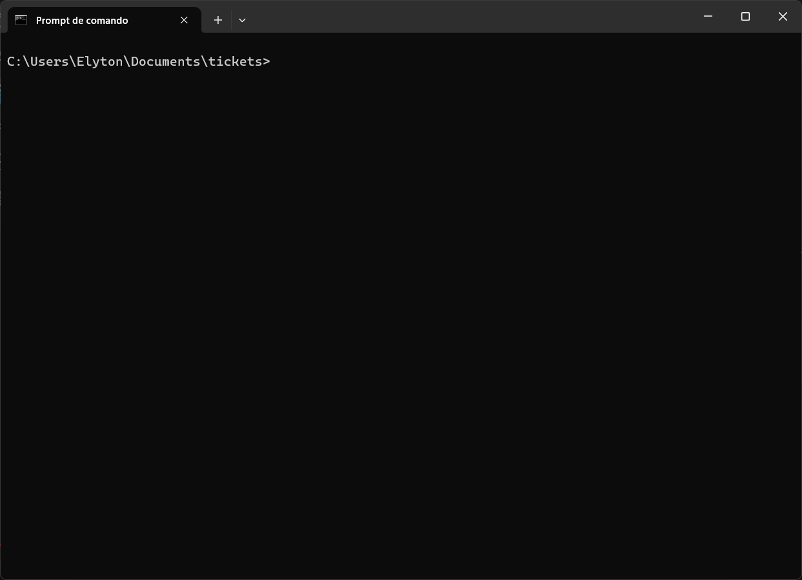

<p align="center">
  <picture>
    <source media="(prefers-color-scheme: dark)" srcset="assets/header-dark.png">
    
  </picture>
</p>

<p align="center">
  Checks the context files your coding agent reads against the code beside them.
</p>

<p align="center">
  <a href="https://www.npmjs.com/package/@tomd4vs/prumo"></a>
  <a href="https://github.com/TomD4vs/prumo/actions/workflows/ci.yml"></a>
  <a href="LICENSE"></a>
</p>

<p align="center">
  <a href="LEIAME.md">
    <picture>
      <source media="(prefers-color-scheme: dark)" srcset="assets/lang-pt-dark.png">
      
    </picture>
  </a>
</p>

<p align="center">
  
</p>

## The problem

Three months ago someone wrote this in `CLAUDE.md`:

```markdown
The sidebar logo lives in `layouts/AppLayout.vue`.
```

The folder has since been renamed to `Layouts`, with a capital L. Windows and macOS still open that path, so nothing ever complained. Linux and CI don't, and every agent that reads the file gets sent somewhere that doesn't exist.

That line survived six hand-run audits of the same files. prumo found it in four seconds.

## Quick start

If you already have [Node.js 18+](https://nodejs.org) and `git`, you are ready. Nothing to install, nothing to configure, no account to create. From a terminal inside any git repository:

```bash
npx @tomd4vs/prumo
```

prumo locates your context files on its own: `CLAUDE.md`, `AGENTS.md`, `.cursor/rules`, `.github/copilot-instructions.md`, installed skills in `.claude/skills/` and the rest. Every file and folder it looks for is in the [reference](docs/reference.md#files-found-automatically).

For frequent use, install it once:

```bash
npm install -g @tomd4vs/prumo             # available everywhere on your machine
npm install --save-dev @tomd4vs/prumo     # or as a dev dependency of one project
```

Either way the command is `prumo`, with zero dependencies. Errors at this step, such as an old Node or a folder that isn't a git repository, are in [Troubleshooting](docs/troubleshooting.md).

## Reading the result

A clean run:

```
prumo — 1 context file, 401 files tracked by git

nothing to review.
```

A run with findings, annotated:

```
prumo — 3 context files, 412 files tracked by git             ← what it read
        1 historical entry exempt from path checks            ← what it skipped on purpose

CASE MISMATCH  (1)   wrong letter case: works on Windows and macOS, fails on Linux and CI
  CLAUDE.md:18                                                ← file and line
      layouts/AppLayout.vue                                   ← what the note says
      ->  resources/js/Layouts/AppLayout.vue                  ← what the repository has

BROKEN LINK  (2)   points at a page or heading that is not there; 1 with a likely destination
  CLAUDE.md:21  [[deploy-checklist]]   ->  deploy_checklist   ← the file it probably meant
  CLAUDE.md:30  [[old-architecture]]                          ← no candidate: renamed or deleted

MISSING PATH  (1)   the note cites it, but git tracks no such file or folder
  docs/setup.md:44  config/database.php                       ← file, line, dead path
      Copy the template into `config/database.php`…           ← the sentence, so you can judge

4 to review, --fix corrects 1                                 ← 1 + 2 + 1
```

Every finding carries a file, a line number and the correction, and a missing path says where git moved it when the history holds a rename. Nothing is guessed and nothing is written. What each finding means, and what to do about it, is in the [reference](docs/reference.md#what-each-finding-means). If it flags a line you know is correct, [Silencing a finding](docs/reference.md#silencing-a-finding) covers the two ways to say so.

## What it will not do

Three limits, chosen on purpose and explained in [Design](docs/design.md):

- It does not judge claims. Whether *"this flag disables caching"* is still true needs a model, and that is a different tool.
- It does not edit beyond letter case and the renames git itself recorded. A link suggested from a name is an educated guess, and a missing path with no history may be missing on purpose.
- It makes no network calls. No telemetry, no account, no model.

Every check was measured on public repositories before it shipped, and the design page publishes the numbers, the ugly ones included.

## Using it from an agent

prumo is a plain CLI, so any agent with shell access can run it.

**Ask the agent to run it.** `npx @tomd4vs/prumo` works in any git repository, and covers skills installed under `.claude/skills/` on its own. For a repository that is itself a skill, name the file: `npx @tomd4vs/prumo . SKILL.md`. The text output names the file, the line and the correction, which is enough for an agent to act on without parsing. `--format json` returns the same findings as structured data.

**Expose it as a tool.** The package also ships `prumo-mcp`, an MCP server over stdio with four tools: `prumo_check`, which is read only, `prumo_fix`, which rewrites letter case and the renames git recorded, and the two reports, `prumo_drift` and `prumo_budget`, read only as well. In Claude Code:

```bash
claude mcp add prumo -- npx -y -p @tomd4vs/prumo prumo-mcp
```

The configuration for any other MCP client is in [Agents](docs/agents.md#expose-it-as-a-tool).

**Add a slash command.** A file at `.claude/commands/prumo.md` turns the check into `/prumo`:

```markdown
Run `npx @tomd4vs/prumo` and fix every finding it reports.
```

**Run it after every edit.** A `PostToolUse` hook runs prumo whenever the agent writes a context file, so the findings land in the transcript and it can fix them in the same turn. The hook, for bash and for PowerShell, is in [Agents](docs/agents.md#run-it-automatically-after-edits).

## Continuous integration

prumo exits non-zero on findings, so it drops into a pipeline as a single step. The shortest form is the action this repository ships:

```yaml
# .github/workflows/docs.yml
name: docs
on: [push, pull_request]
jobs:
  prumo:
    runs-on: ubuntu-latest
    steps:
      - uses: actions/checkout@v4
      - uses: TomD4vs/prumo@v1
```

It annotates the exact line of the pull request and fails the job when something needs review. `npx @tomd4vs/prumo --quiet` after `actions/setup-node` does the same in any pipeline. Use `actions/checkout` as normal; prumo reads the git index, so a checkout that omits it will not work. Three options cover the rest:

- `--baseline` records what a repository with a backlog already has, once; later runs fail only on what is new.
- `--since origin/main` checks only the context files a pull request touched.
- `--sarif FILE` writes the findings for code scanning, and `.pre-commit-hooks.yaml` runs the same check before each commit through the pre-commit framework.

The action's inputs, the SARIF upload and the pre-commit block are in the [reference](docs/reference.md#continuous-integration).

## Two reports

Beyond the checks, two commands measure instead of judging, and exit 0 whatever they find:

```bash
prumo drift     # which sections describe code that changed since they were written
prumo budget    # what each context file costs the agent, and what is written twice
```

`drift` reads from `git blame` when each section was last written, counts the commits that touched the files it cites since then, and lists the sections most moved first: a reading order for a review, since a section whose files changed forty times may still be right. `budget` estimates the tokens each file costs at every session, how much that grew since a commit, and which paragraphs are written in more than one place. Both are on the [reference](docs/reference.md#two-reports-drift-and-budget), and both are tools of the MCP server.

## Documentation

| Page | What it answers |
| --- | --- |
| [Reference](docs/reference.md) | Every option and exit code, what each finding means, how to silence one, what `--fix` touches |
| [Agents](docs/agents.md) | Every integration in full: the MCP server, the `PostToolUse` hook for bash and PowerShell, the slash command |
| [Design](docs/design.md) | Why so few checks: the measurement that removed the symbol checker, and the filters that keep the rest quiet |
| [Troubleshooting](docs/troubleshooting.md) | Error messages, and the questions people ask before adopting it |
| [API](docs/api.md) | Calling it from code, and running the test suite |

## License

MIT
